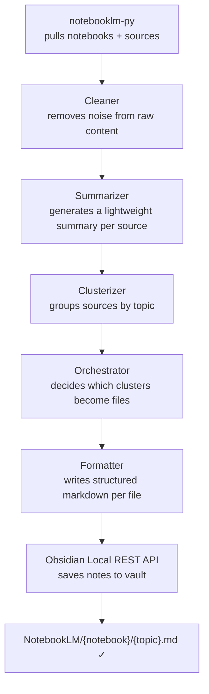

<p align="left">
  
</p>

---

Automatically syncs [NotebookLM](https://notebooklm.google.com/) notebooks into structured [Obsidian](https://obsidian.md/) notes via a multi-agent LLM pipeline.


---

## What nb2ob does

Fetches all your NotebookLM notebooks and their sources, runs them through an agent pipeline that cleans, summarizes, clusters, and formats the content, then writes the result as structured markdown notes directly into your Obsidian vault.

No copying. No pasting. No manual formatting.

---

## How it works



Each notebook becomes a folder in your vault. Each topic cluster becomes a `.md` file inside it.

---

## Generated note structure

```markdown
## 📋 Resumo

## 📚 Conteúdo
### 🔹 [Topic]
...
```

---

## Project structure

```text
nb2ob/
├── main.py                     # CLI entry point (typer)
│
├── agent/
│   ├── graph.py                # builds and compiles the LangGraph pipeline
│   ├── state.py                # PipelineState and TypedDicts
│   ├── nodes/                  # one file per agent (cleaner, summarizer, etc.)
│   └── prompts/                # one file per agent + base.py
│
├── api/
│   ├── __init__.py
│   ├── notebooklm.py           # NotebookLM unofficial API wrapper
│   └── obsidian.py             # Obsidian Local REST API wrapper
│
├── config/
│   ├── settings.py             # Config dataclass with env var validation
│   └── models.py               # Model enum
│
├── infrastructure/
│   ├── config.py               # logger setup
│   └── decorators.py           # log_call decorator
│
└── docs/                       # images used in this README
```

---

## Prerequisites

- [Python 3.11+](https://www.python.org/)
- [uv](https://docs.astral.sh/uv/)
- [Obsidian](https://obsidian.md/) with the **Local REST API** plugin installed and active
- A Google account with access to [NotebookLM](https://notebooklm.google.com/)
- API key from at least one supported provider (Groq, Gemini, or Anthropic)

---

## Setup

### 1. Clone the repository

```bash
git clone https://github.com/DaviAlcanfor/nb2ob.git
cd nb2ob
```

### 2. Install dependencies

```bash
uv sync
playwright install chromium
```

### 3. Install and configure the Obsidian plugin

Open Obsidian and go to `Settings → Community Plugins`.


Click **Browse** and search for **Local REST API with MCP**.


Install and enable it. Then go to `Settings → Local REST API & MCP Server` to find your bearer token.


Copy the token — you'll need it in the next step.


### 4. Authenticate with NotebookLM

```bash
notebooklm login
```

This opens a browser for you to sign in with your Google account. Credentials are stored locally and reused on subsequent runs. If the session expires, run it again.

### 5. Configure environment variables

```bash
cp .env.example .env
```

```env
# Obsidian Local REST API
OBSIDIAN_TOKEN=<your_bearer_token>      # from Settings > Local REST API & MCP Server
OBSIDIAN_HOST=https://127.0.0.1        # change only if you modified the plugin settings
OBSIDIAN_PORT=27124                    # change only if you modified the plugin settings
OBSIDIAN_FOLDER=NotebookLM             # root folder in your vault where notes will be saved

# LLM Provider (at least one required)
GROQ_API_KEY=<your_groq_api_key>       # https://console.groq.com/keys
GEMINI_API_KEY=<your_gemini_api_key>   # https://aistudio.google.com/apikey
ANTHROPIC_API_KEY=<your_anthropic_key> # https://console.anthropic.com/keys
```

### 6. Run

```bash
uv run main.py
```

---

## Supported models

At least one API key is required. The pipeline currently uses Groq by default.

| Provider  | Model                          | Get key |
|-----------|--------------------------------|---------|
| Groq      | `llama-3.3-70b-versatile`      | [console.groq.com](https://console.groq.com/keys) |
| Gemini    | `gemini-2.0-flash`             | [aistudio.google.com](https://aistudio.google.com/apikey) |
| Anthropic | `claude-sonnet-4-20250514`     | [console.anthropic.com](https://console.anthropic.com/keys) |

---

## Main dependencies

- [notebooklm-py](https://github.com/teng-lin/notebooklm-py) — unofficial NotebookLM Python API
- [LangChain + LangGraph](https://github.com/langchain-ai/langgraph) — agent pipeline orchestration
- [langchain-groq](https://python.langchain.com/docs/integrations/chat/groq/) — Groq LLM integration
- [typer](https://typer.tiangolo.com/) — CLI
- [requests](https://docs.python-requests.org/) — Obsidian API communication
- [python-dotenv](https://github.com/theskumar/python-dotenv) — environment variables

---

## ⚠️ Disclaimer

`notebooklm-py` is an unofficial library that uses undocumented Google APIs. It is not affiliated with Google and may break without notice. Use at your own risk.

---

## License

MIT