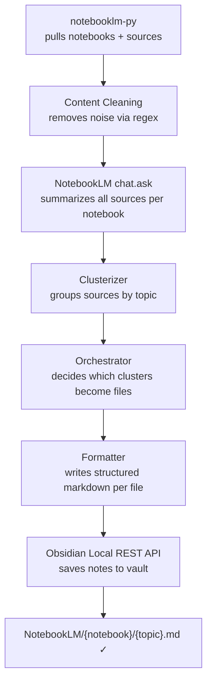
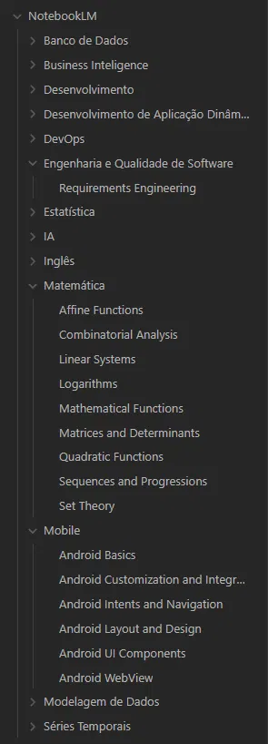
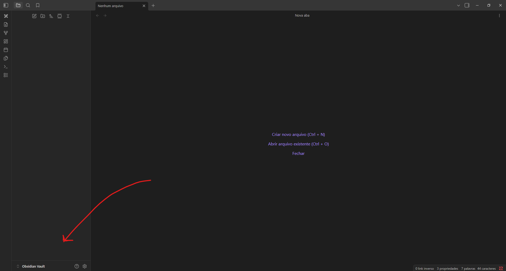
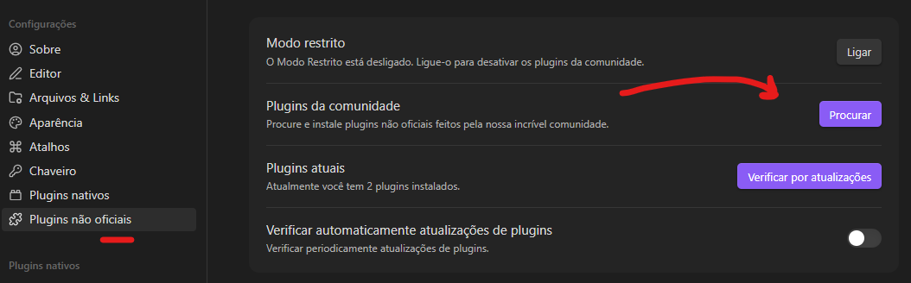
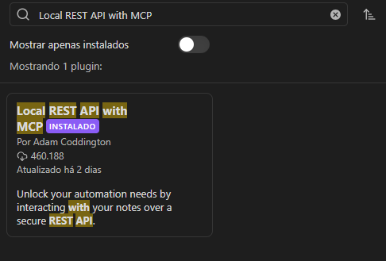
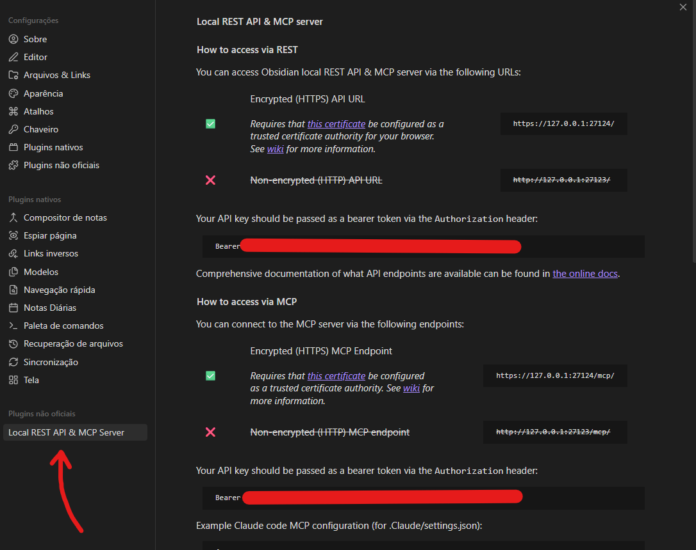
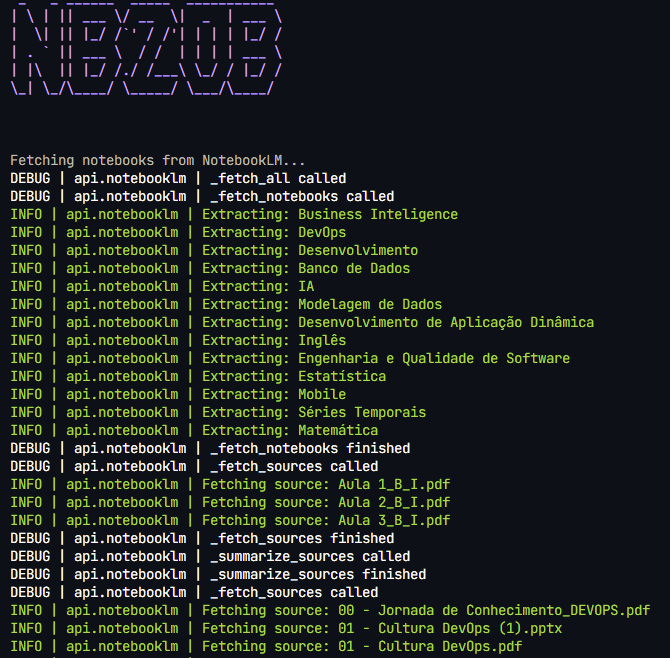

<p align="left">
  
</p>

---

Automatically syncs [NotebookLM](https://notebooklm.google.com/) notebooks into structured [Obsidian](https://obsidian.md/) notes via a multi-agent LLM pipeline.


---

## Why this exists

I use NotebookLM to organize study material — slides, PDFs, articles — grouped by subject. After each session, I'd manually copy the content into Obsidian to have proper, searchable notes. That got old fast.

nb2ob automates the entire thing: it pulls your notebooks, processes the sources through an agent pipeline, and writes structured markdown notes directly into your vault.

---

## How it works



Each notebook becomes a folder in your vault. Each topic cluster becomes a `.md` file inside it.

---

## Pipeline design

The current pipeline has 3 LLM agents. It evolved from an earlier design that had 5.

### Original design — 5 agents

| Agent | Role |
|---|---|
| **Cleaner** | Received raw source content from the API and removed noise — broken URLs, image tokens, floating newlines — before passing it downstream |
| **Summarizer** | Condensed each cleaned source into a short summary so the Clusterizer could group them without processing full content |
| **Clusterizer** | Received all summaries and decided which sources belonged together — since multiple sources can cover the same subject |
| **Orchestrator** | Received the clusters and their raw content, then called the Formatter once per group |
| **Formatter** | Turned raw content into a readable, study-ready markdown note |

This design worked conceptually but hit a hard wall in practice: **free-tier token limits**. Sending full source content through a Cleaner LLM, then a Summarizer LLM, meant exhausting Groq's 500k daily quota in a single run — before the pipeline even reached the Clusterizer.

### Current design — 3 agents

The two most token-heavy agents were replaced with cheaper alternatives:

- **Cleaner** → regex. URL removal, image token stripping, and newline normalization don't need an LLM.
- **Summarizer** → `chat.ask`. NotebookLM already understands the sources. One API call per notebook summarizes all sources at once, at zero LLM token cost.

The remaining 3 agents — Clusterizer, Orchestrator, and Formatter — still run through an LLM pipeline with a Groq → Cerebras → OpenRouter fallback chain.

---

## Result

After a full run across all your notebooks, nb2ob generates a structured folder tree in your vault:



Each note follows this structure:

```markdown
---
tags: []
source: NotebookLM
---

## 📋 Resume
3 to 5 sentences covering the main themes of the material.

## 📚 Content

### 🔹 Topic Name
- Concept explained in clear, didactic language
- **Key terms** bolded on first mention

```bash
# commands and code snippets preserved exactly
```
```

---

## Project structure

```text
nb2ob/
├── main.py                     # CLI entry point (typer)
│
├── agent/
│   ├── graph.py                # builds and compiles the LangGraph pipeline
│   ├── llms.py                 # LLM instances and fallback chain
│   ├── state.py                # PipelineState and TypedDicts
│   ├── nodes/                  # one file per agent (clusterizer, orchestrator, formatter)
│   └── prompts/                # one file per agent + base.py
│
├── api/
│   ├── __init__.py
│   ├── notebooklm.py           # NotebookLM unofficial API wrapper
│   ├── obsidian.py             # Obsidian Local REST API wrapper
│   ├── _types.py               # shared TypedDicts (Sources, Notebook, SummarizedSource)
│   ├── _cleaning.py            # regex-based content cleaning
│   └── _summarizer.py          # chat.ask prompt and response parsing
│
├── config/
│   ├── settings.py             # Config dataclass with env var validation
│   └── models.py               # Model enum and provider maps
│
├── infrastructure/
│   ├── config.py               # logger setup
│   ├── decorators.py           # log_call decorator
│   └── display.py              # banner and spinner
│
└── docs/                       # images used in this README
```

---

## Prerequisites

- [Python 3.11+](https://www.python.org/)
- [uv](https://docs.astral.sh/uv/)
- [Obsidian](https://obsidian.md/) with the **Local REST API** plugin installed and active
- A Google account with access to [NotebookLM](https://notebooklm.google.com/)
- API key from at least one supported provider (see table below)

---

## Setup

### 1. Clone the repository

```bash
git clone https://github.com/DaviAlcanfor/nb2ob.git
cd nb2ob
```

### 2. Install dependencies

```bash
uv sync
playwright install chromium
```

### 3. Install and configure the Obsidian plugin

Open Obsidian and go to `Settings → Community Plugins`.



Click **Browse** and search for **Local REST API with MCP**.



Install and enable it. Then go to `Settings → Local REST API & MCP Server` to find your bearer token.



Copy the token — you'll need it in the next step.



### 4. Authenticate with NotebookLM

```bash
notebooklm login
```

This opens a browser for you to sign in with your Google account. Credentials are stored locally and reused on subsequent runs. If the session expires, run it again.

### 5. Configure environment variables

```bash
cp .env.example .env
```

```env
# Obsidian Local REST API
OBSIDIAN_TOKEN=<your_bearer_token>      # from Settings > Local REST API & MCP Server
OBSIDIAN_HOST=https://127.0.0.1        # change only if you modified the plugin settings
OBSIDIAN_PORT=27124                    # change only if you modified the plugin settings
OBSIDIAN_FOLDER=NotebookLM             # root folder in your vault where notes will be saved

# LLM Providers (at least one required)
GROQ_API_KEY=<your_groq_api_key>       # https://console.groq.com/keys
GEMINI_API_KEY=<your_gemini_api_key>   # https://aistudio.google.com/apikey
ANTHROPIC_API_KEY=<your_anthropic_key> # https://console.anthropic.com/keys
CEREBRAS_API_KEY=<your_cerebras_key>   # https://cloud.cerebras.ai
OPEN_ROUTER_KEY=<your_openrouter_key>  # https://openrouter.ai/settings/keys

# OpenRouter (optional — default already set in code)
OPENROUTER_BASE_URL=https://openrouter.ai/api/v1
```

### 6. Run

Sync all notebooks:

```bash
uv run main.py
```

Sync a single notebook by name:

```bash
uv run main.py --notebook "DevOps"
```



---

## Supported providers

At least one API key is required. The pipeline uses Groq as primary with Cerebras and OpenRouter as fallbacks.

| Provider   | Model                                 | Free tier       | Get key |
|------------|---------------------------------------|-----------------|---------|
| Groq       | `llama-3.3-70b-versatile`             | 500k tokens/day | [console.groq.com](https://console.groq.com/keys) |
| Cerebras   | `llama-3.3-70b`                       | 1M tokens/day   | [cloud.cerebras.ai](https://cloud.cerebras.ai) |
| OpenRouter | `deepseek/deepseek-chat-v3-0324:free` | 50 req/day      | [openrouter.ai](https://openrouter.ai/settings/keys) |
| Gemini     | `gemini-2.5-flash`                    | 1500 req/day    | [aistudio.google.com](https://aistudio.google.com/apikey) |
| Anthropic  | `claude-sonnet-4-6`                   | paid only       | [console.anthropic.com](https://console.anthropic.com/keys) |

---

## Main dependencies

- [notebooklm-py](https://github.com/teng-lin/notebooklm-py) — unofficial NotebookLM Python API
- [LangChain + LangGraph](https://github.com/langchain-ai/langgraph) — agent pipeline orchestration
- [langchain-groq](https://python.langchain.com/docs/integrations/chat/groq/) — Groq LLM integration
- [langchain-cerebras](https://python.langchain.com/docs/integrations/chat/cerebras/) — Cerebras LLM integration
- [langchain-openai](https://python.langchain.com/docs/integrations/chat/openai/) — OpenRouter via OpenAI-compatible API
- [typer](https://typer.tiangolo.com/) — CLI
- [pyfiglet](https://github.com/pwaller/pyfiglet) — terminal banner
- [yaspin](https://github.com/pavdmyt/yaspin) — terminal spinner
- [requests](https://docs.python-requests.org/) — Obsidian API communication
- [python-dotenv](https://github.com/theskumar/python-dotenv) — environment variables

---

## ⚠️ Disclaimer

`notebooklm-py` is an unofficial library that uses undocumented Google APIs. It is not affiliated with Google and may break without notice. Use at your own risk.

---

## License

MIT
