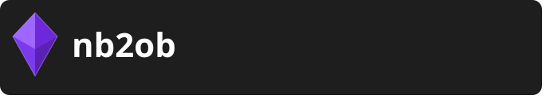

<p align="left">
  
</p>

---

Automatically syncs [NotebookLM](https://notebooklm.google.com/) notebooks into structured [Obsidian](https://obsidian.md/) notes.


---

## What nb2ob does

Connect your Google account, select which notebooks to sync, hit Sync — notes show up in your vault, formatted and ready.

No copying, no pasting, no manual formatting.

---

## How it works

```text
notebooklm-py pulls notebook content
          │
          ▼
     Agent formats via LLM
          │
          ▼
  Obsidian Local REST API
          │
          ▼
  Note created in vault ✓
```

---

## Generated note structure

Every note follows this structure (written in Brazilian Portuguese):

```markdown
## 📋 Resumo

## 📚 Conteúdo
### 🔹 [Topic]
...
```

---

## Project structure

```text
nb2ob/
├── main.py
├── config.py
│
├── agent/
│   ├── prompt.py           # template and prompt generation
│   └── formatter.py        # LLM call via LiteLLM
│
├── api/
│   ├── notebooklm.py       # NotebookLM unofficial API wrapper
│   └── obsidian.py         # Obsidian Local REST API wrapper
│
├── infrastructure/
│   ├── config.py           # colored logger setup
│   └── decorators.py       # log_call decorator
│
└── interface/
    ├── App.py              # main window
    ├── themes.py           # colors and styles
    └── components/
        ├── AppTitle.py
        ├── Button.py
        ├── StatusMessage.py
        └── TextInput.py
```

---

## Prerequisites

- [Python 3.11+](https://www.python.org/)
- [uv](https://docs.astral.sh/uv/)
- [Obsidian](https://obsidian.md/) with the **Local REST API** plugin installed and active
- A Google account with access to [NotebookLM](https://notebooklm.google.com/)
- API key from any supported provider (Groq, Gemini, Anthropic, etc.)

### Installing the Obsidian plugin

`Settings → Community Plugins → Browse → search "Local REST API" → install → enable`

After enabling, copy your token at: `Settings → Local REST API`

---

## Setup

### 1. Clone the repository

```bash
git clone https://github.com/DaviAlcanfor/nb2ob.git
cd nb2ob
```

### 2. Install dependencies

```bash
uv sync
playwright install chromium
```

### 3. Authenticate with Google

```bash
notebooklm login
```

This opens a browser for you to sign in with your Google account. Credentials are stored locally.

### 4. Configure environment

```bash
cp .env.example .env
```

```env
OBSIDIAN_TOKEN=<your_bearer_api_key_here>
OBSIDIAN_HOST=https://127.0.0.1
OBSIDIAN_PORT=27124
OBSIDIAN_FOLDER=NotebookLM

AGENT_MODEL=groq/llama-3.3-70b-versatile
AGENT_API_KEY=<your_api_key_here>
```

### 5. Run

```bash
uv run main.py
```

---

## Supported models

Any model supported by [LiteLLM](https://docs.litellm.ai/docs/providers). Just set `AGENT_MODEL` in your `.env`.

| Provider | Example |
| --- | --- |
| Groq (default) | `groq/llama-3.3-70b-versatile` |
| Google Gemini | `gemini/gemini-2.0-flash` |
| Anthropic | `claude-sonnet-4-20250514` |
| OpenAI | `gpt-4o` |

---

## Main dependencies

- [notebooklm-py](https://github.com/teng-lin/notebooklm-py) — unofficial NotebookLM Python API
- [LiteLLM](https://github.com/BerriAI/litellm) — unified interface for multiple LLMs
- [CustomTkinter](https://github.com/TomSchimansky/CustomTkinter) — GUI
- [requests](https://docs.python-requests.org/) — Obsidian API communication
- [python-dotenv](https://github.com/theskumar/python-dotenv) — environment variables

---

## ⚠️ Disclaimer

`notebooklm-py` is an unofficial library that uses undocumented Google APIs. It is not affiliated with Google and may break without notice. Use at your own risk.

---

## License

MIT